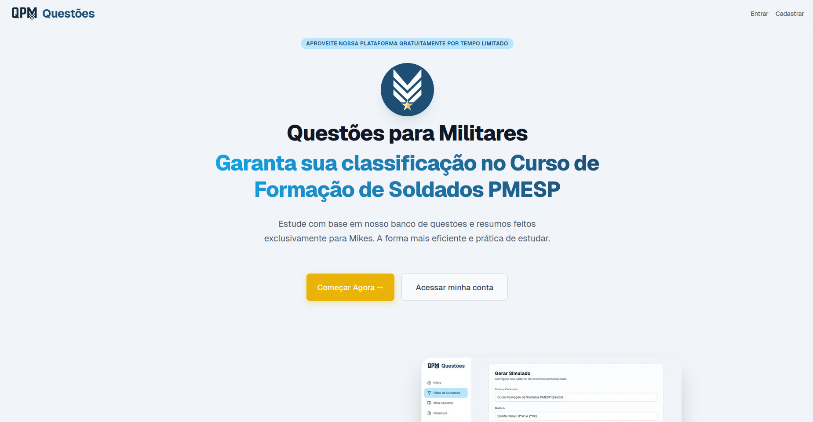
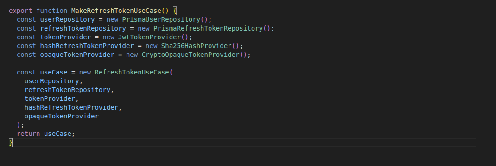
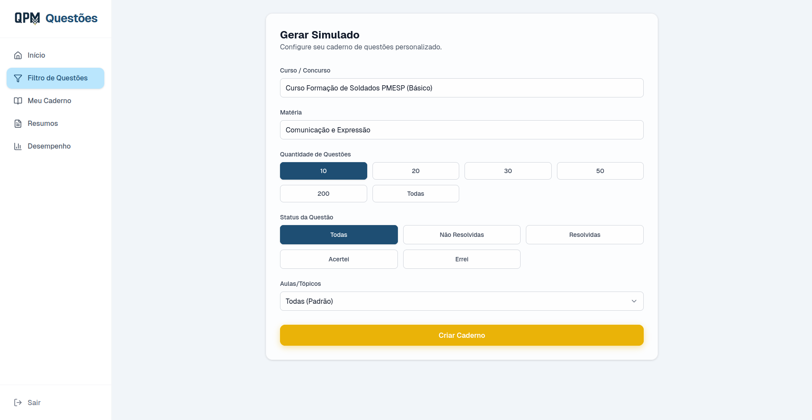
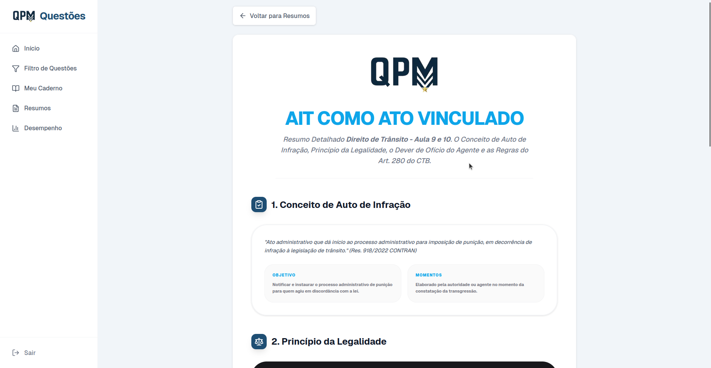
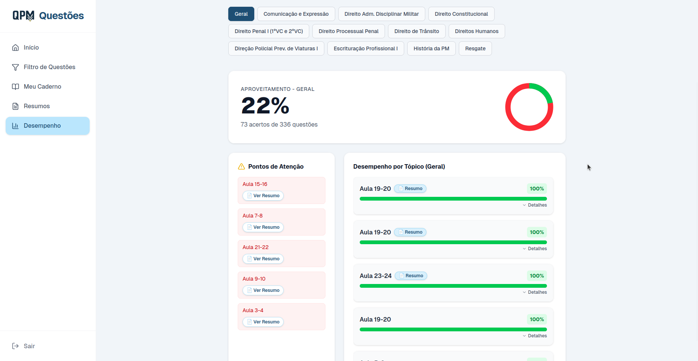

# 🚀 QPM Questões | Engineering Case Study

**Live Project:** [qpmquestoes.com](https://qpmquestoes.com)

## 🎯 Visão Geral
O **QPM Questões** é um ecossistema de aprendizado focado em concursos públicos e Cursos de Formação para militares, integrando um vasto banco de questões e resumos pedagógicos dinâmicos. 

Este repositório serve como um **Case Study** técnico de uma aplicação em produção, destacando como uma arquitetura bem planejada e uma infraestrutura otimizada podem sustentar centenas de usuários simultâneos com baixíssimo custo operacional.

---

## 🏗️ Arquitetura de Software & Design Patterns

### Backend for Frontend (BFF) & Auth Flow
Implementamos o padrão **BFF** para desacoplar a complexidade da autenticação do cliente.
*   **Next.js Middleware:** Atua como um proxy inteligente que gerencia a persistência e renovação de tokens JWT em conjunto com o backend. Isso isola a lógica de sessão e aumenta a segurança contra ataques client-side.

### Princípios de Engenharia (SOLID & Clean Arch)
O backend segue rigorosamente os princípios do **SOLID**, garantindo um sistema altamente testável e de fácil manutenção:
*   **Desacoplamento Total:** Uso de **Inversão de Dependência (DIP)** para garantir que Use Cases dependam de interfaces, não de implementações concretas (Prisma, Redis, etc).
*   **Substituição de Liskov (LSP):** Repositories e Providers seguem contratos estritos, permitindo a troca de provedores de infraestrutura sem afetar a lógica de domínio.
*   **Arquitetura em Camadas:** Separação clara entre `Controllers` (Entry Points), `UseCases` (Business Logic), `Repositories` (Data Persistence) e `Providers` (External Services).
*   **Qualidade de Software:** Implementação de **testes unitários** que validam os Use Cases isoladamente de IO, garantindo a integridade do Core Business.

### Patterns de Modules & Factory
Para escalar a aplicação de forma organizada e desacoplada, utilizamos:
*   **Module Pattern:** Estruturação da lógica em módulos independentes e coesos, facilitando a manutenção e a reutilização de componentes.
*   **Factory Pattern:** Implementação de fábricas para a criação de instâncias complexas, centralizando a lógica de instanciação e garantindo que os objetos sejam criados com todas as dependências necessárias de forma consistente.

### Gerenciamento de Persistência
*   **PostgreSQL & Connection Pooling:** Configuração avançada de pool de conexões para evitar overhead no banco de dados durante picos de tráfego, garantindo que cada query seja executada com o mínimo de latência.
*   **Redis Rate Limiting:** Sistema de controle de vazão distribuído no Redis, configurado para ser totalmente compatível com as regras de borda da **Cloudflare**, protegendo o sistema contra brute-force e scraping.

---

## 🛠️ Infraestrutura & DevOps (Efficiency-First)

O projeto é hospedado em uma **VPS de baixo custo**, mas opera com a resiliência de grandes infraestruturas.

### Orquestração com Coolify
Utilizamos o **Coolify** para orquestrar o ambiente de produção via Docker.
*   **Container Replicas:** O serviço é distribuído em múltiplas réplicas de containers para garantir alta disponibilidade.
*   **Resource Limit Management:** Cada réplica possui limites de CPU e Memória RAM configurados de forma granular, extraindo o máximo de cada thread da VPS sem causar instabilidade no sistema operacional.

### Segurança e Resiliência
*   **Cloudflare Gateway:** Proteção de borda, cache de estáticos e otimização de tráfego.
*   **Backups Externos (Cloudflare R2):** Rotina automatizada de backups do PostgreSQL enviados para o Cloudflare R2 (S3-compatible), garantindo Disaster Recovery fora da infraestrutura principal.
*   **CI Pipeline:** Fluxo de automação via GitHub Actions que valida Lint, Tipagem e Testes antes de qualquer deploy em produção.

---

## ⚡ Performance & Stress Testing (k6)

Um dos maiores marcos técnicos foi a validação da escalabilidade através de testes de carga distribuídos.

> **Cenário de Teste:** Simulação de 700 usuários simultâneos realizando buscas, filtros e navegação entre questões e resumos.
> **Resultado:** 100% dos testes passaram, sem erros 500 ou 504.

---

## 📚 Funcionalidades de Produto

*   **Questões Vinculadas:** Sistema de relacionamento onde cada questão está conectada a um curso e tópico específico.
*   **Direcionamento Inteligente:** Ao responder uma questão, o usuário é capaz de acessar o **Resumo Pedagógico** exato daquele tópico com um clique.
*   **Filtros Avançados:** Motor de busca e filtragem otimizado para lidar com grandes volumes de dados de questões sem perda de performance.

---

## 📸 Screenshots do Produto

### 1. Interface de Questões

### 2. Interface de Filtros Para criação de Cadernos

### 3. Interface de Resumos Pedagógicos

### 4. Interface do Painel de Desempenho

---

## 🚀 Tech Stack

*   **Frontend:** Next.js (App Router), Tailwind CSS, Framer Motion.
*   **Backend:** Node.js, Fastify, TypeScript, Prisma ORM.
*   **Database:** PostgreSQL & Redis.
*   **Infra:** Coolify, Docker, Cloudflare (WAF & R2).
*   **Tools:** k6 (Stress Testing), GitHub Actions (CI), Postmark/Resend (Email).

---

### Autor
**Antonio Alves Cataldo**
[LinkedIn](https://www.linkedin.com/in/antoniocataldo-devfullstack/) | [Email](mailto:antoniotonyzz71@gmail.com)
